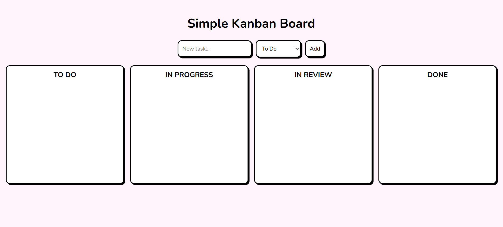

# Simple Kanban board
A simple Kanban board built with HTML, CSS, and JavaScript.

### Features
- Add tasks: Create new tasks and assign them to any column.
- Drag & drop: Move tasks between columns using drag-and-drop functionality.
- Delete tasks: Remove tasks individually.
- Persistent storage: All tasks and their positions are saved in `localStorage`.

### Columns
The board contain four columns:
1. To Do - tasks that need to be started.
2. In Progress - tasks currently being worked on.
3. In Review - tasks under review or pending approval.
4. Done - completed tasks.

### Technologies used
- HTML5
- CSS3
- JavaScript
- Google Fonts

## Installation guide
1. Copy or download this repository: `https://github.com/dianabali/kanban-board.git`.
2. Open `index.html` in your browser.

## Preview

